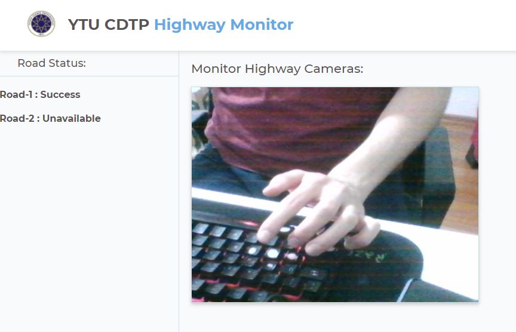

# YTU CDTP Web Control Center  

This project aiming to create a web monitor server for handling all processes coming from Raspberry Pi Highway Sensors and Cameras. 

This project uses venv for manage python virtual environment so follow this guideline.  

# 1-Install venv and Create venv
- https://docs.python.org/3/library/venv.html  
- pip install virtualenv
- python -m venv venv
- (Windows) .\venv\Scripts\activate
- (Linux) ./venv/Scripts/activate
- You are ready to go!!!

# 2-Usage
- Go to project directory via activated venv cli
- pip install -r requirements.txt
- copy .env-example > .env (fill custom env if required)
- run flask_run_pc.sh 

# 3-Env  
Default Env  

````
PC_APP_BIND="0.0.0.0"
PC_APP_PORT=5000
PI_STREAM_HOST="localhost"
PI_STREAM_PORT=5001
PI_STREAM_URL="video_feed"
```  

# 4-URLs
GET / - Server Status  
GET /monitor - Monitor Highway Interface  
GET /video_feed - Raspberry Pi Camera Stream




